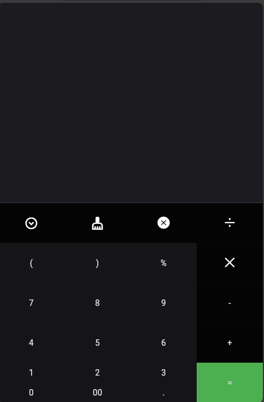

# وظيفة تطبيقات جوال Flutter 04-2024
- قم بتطبيق التصميمين المرفقين بالصور، تصميم الآلة الحاسبة معتمد على Expanded، وتصميم البطاقة معتمد على Stack.
- بعد أن تنتهي قم بتنفيذ التعليمة التالية في سطر الأوامر: flutter clean، والتي تقوم بإزالة ملفات البناء للمشروع وتقليل حجمه إلى عدة ميجاوات.
  بعد ذلك قم بضغط المشروع ورفعه هنا.

A new Flutter project.

## Getting Started

### First Image 

### Second Image
